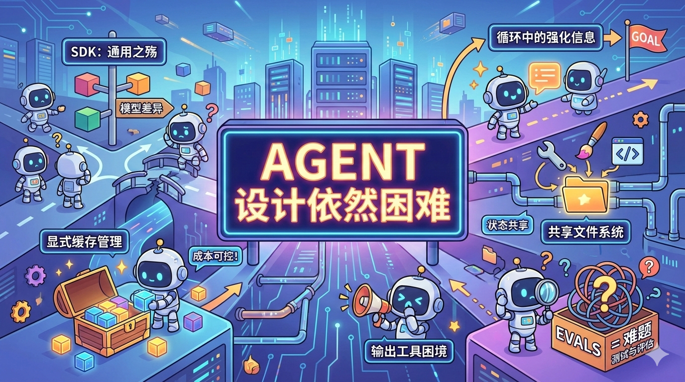

#### 作者
Armin Ronacher 是著名的开源软件工程师，Flask Web 框架、Jinja2 模板引擎及 Click 命令行工具的创造者，其作品定义了现代 Python 开发的简洁范式，并对全球开源生态产生了深远影响。

#### 概览
Agent 设计的本质并非简单的循环，而是对模型差异、显式缓存控制与强化信息的极致平衡，在这个领域，过于通用的 SDK 往往是灵活性的枷锁。

<!-- excerpt -->
---

## 一. 综述

本文深度总结了作者在构建自主 Agent（代理）过程中的工程实践与教训。作者指出，尽管 Agent 核心逻辑看似简单的循环，但实际落地中，通用的 SDK 抽象往往难以应对不同模型间的细微差异。通过强调显式缓存管理、在循环中引入强化信息（Reinforcement）、利用虚拟文件系统实现状态共享、以及对输出工具的精细控制，作者揭示了构建高性能 Agent 必须跨越的工程复杂性，并直言测试与评估（Evals）仍是当前行业最大的痛点。

---

## 二. 详解

1. **SDK 选择的逆向反思**：
作者放弃了 Vercel AI 等高层抽象 SDK，回归到原始供应商（如 Anthropic/OpenAI）的 SDK。原因在于不同模型在缓存控制、强化需求和工具提示方面存在显著差异，通用的 messaging 格式（如 Vercel 尝试的统一）在处理特定模型（如 Anthropic 的搜索工具）时会破坏历史记录或导致错误。

2. **转向显式缓存管理**：
作者从反感转向拥护 Anthropic 的“手动管理缓存点”模式。显式缓存让成本和利用率变得可预测，并允许进行“对话分支（Conversation Splitting）”和“上下文编辑”。通过在系统提示词后和对话初期设置静态缓存点，并将动态信息（如当前时间）置于后期消息中，可有效避免缓存失效。

3. **循环中的“强化信息”注入**：
在 Agent 运行工具后，不仅应返回工具数据，还应实时反馈“强化信息”（如任务目标提醒、错误修复提示或后台状态变更）。甚至可以引入“回声工具”（Echo Tool），让 Agent 自行梳理待办列表并反馈给自己，以确保长链路任务不偏离轨道。

4. **失败隔离与上下文编辑**：
为了避免执行失败污染全局上下文，建议将复杂任务交给子 Agent 迭代，仅向主 Agent 汇报成功结果或精简后的失败总结。虽然“上下文编辑”能节省 Token 并清除无用尝试，但其代价是破坏缓存，需权衡成本。

5. **以文件系统为核心的状态共享**：
Agent 不应存在“死胡同工具”。通过构建虚拟文件系统作为共享层，不同工具（如代码执行工具、推理工具、图像生成工具）可以读写同一路径。这解决了子任务产出无法被后续工具利用的协同问题。

6. **输出工具的特殊困境**：
作者使用专门的“输出工具”（如发邮件）而非单纯的文本回复来与人沟通。但实践发现，模型在调用工具时难以控制语气和质量，且有时会跳过工具调用。目前的对策是监控调用状态，并在循环结束前注入强化消息强迫其输出。

7. **模型选型的务实策略**：
Anthropic 的 Haiku 和 Sonnet 仍是目前最强的工具调用者，其成本效率优于 Token 单价更低但逻辑较差的模型。Gemini 2.5 在处理长文档、PDF 及图像提取（绕过安全过滤）方面表现出色。

8. **工程痛点：测试与评估（Evals）**：
Agent 的自主性导致其无法像简单 Prompt 那样在外部系统中测试。目前缺乏令人满意的基于可观测性数据或自动化运行的评估方案，这已成为 Agent 工程化的主要阻碍。

---

## 三. 提问

1. **关于抽象层**：随着 Agent 技术成熟，未来是否可能诞生一种既能保留模型特性、又能提供足够工程便利的“标准抽象”，还是说 Agent 开发注定是高度定制化的？

2. **关于缓存与成本**：在追求高效率的“上下文编辑”（减少 Token 堆积）与保持“显式缓存”（降低计算开销）之间，是否存在一个自动化的最优平衡点？

3. **关于人机交互**：如果 Agent 的内部思维过程与最终输出工具是解耦的，我们该如何建立一套机制，既能让用户信任 Agent 的决策路径，又不被海量的中间步骤所淹没？

原文:[Agent Design Is Still Hard](https://lucumr.pocoo.org/2025/11/21/agents-are-hard/)