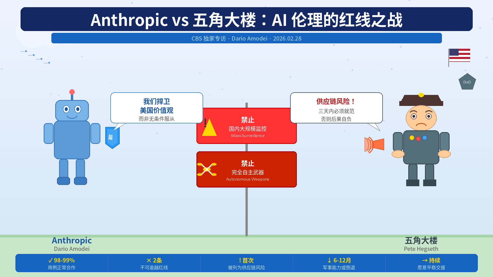

#### 作者简介
Jo Ling Kent 是 CBS News 高级商业与科技记者，拥有逾 15 年报道科技与商业交叉领域的经验，其报道覆盖人工智能影响、社交媒体隐私、全球供应链及中国经济崛起等议题，曾获 Edward R. Murrow 奖及三项 Emmy 提名。

#### 嘉宾简介
Dario Amodei，1983 年生于旧金山，是 Anthropic 的联合创始人兼 CEO；此前任职 OpenAI 研究副总裁，主导了 GPT-2 和 GPT-3 的开发，并是强化学习人类反馈（RLHF）方法的共同发明人；2021 年与其妹 Daniela 共同创立 Anthropic，专注 AI 安全研究，截至 2026 年 2 月公司估值约 3800 亿美元。

#### 金句
反对政府，是世界上最美国的事情——我们在这一切中都是爱国者，我们捍卫的是这个国家的价值观。

<!-- excerpt -->
---

## 一. 综述

本次专访发生在五角大楼宣布将 Anthropic 列为"供应链风险"数小时后。Amodei 坚守两条红线：禁止 AI 用于国内大规模监控与完全自主武器。他将政府的打压定性为"报复性与惩罚性"举措，指出该供应链指定从未用于美国本土公司。他强调 Anthropic 是最积极配合军方的 AI 公司，愿在红线内继续服务国家安全，并将在收到正式文件后提起法律诉讼。他认为自己的立场本质上是在维护美国的民主价值观，而非对抗政府。

## 二. 详解

### 1. Anthropic 为何拒绝向政府提供无限制 AI 访问权
Anthropic 是所有 AI 公司中与美国政府合作最为积极的一家——率先将模型部署于机密云端，率先为国家安全制作定制模型，并已广泛服务于情报界与军事领域。Amodei 明确表示，公司同意国防部约 98%～99% 的使用场景，仅对两类用途设置红线：其一是国内大规模监控——AI 使原本合法但无实用价值的数据分析成为可能，导致技术已超越现行法律框架；其二是完全自主武器——当前 AI 存在基本不可预测性，尚未具备独立决策可靠性，且缺乏对大规模无人作战系统的问责机制。

### 2. 为何无法与五角大楼达成协议
谈判在三天最后通牒的窗口期内进行。五角大楼向 Anthropic 提交的协议草案，表面上接受了其条件，实则附加了"如五角大楼认为适当"等弹性条款，未在任何实质层面做出让步。五角大楼发言人的公开声明始终是"我们只允许一切合法用途"，未对 Anthropic 的例外要求给予任何有效回应。Amodei 强调，整个谈判时间表由国防部主导，而非 Anthropic。

### 3. 对 Trump 指责 Anthropic "危害国家安全" 的回应
Amodei 表示，即便在政府采取极端措施的情况下，Anthropic 仍承诺提供服务连续性，协助国防部平稳过渡至其他供应商，以避免军事行动受到中断。他指出，一线军事人员告诉他，失去 Anthropic 的技术支持将使相关能力倒退 6 至 12 个月甚至更长时间，这是他们努力争取协议的原因。

### 4. 对 Hegseth 将 Anthropic 列为"供应链风险" 的反应
Amodei 称此举"报复性且惩罚性"。该供应链指定历史上从未用于美国本土公司，过去仅适用于俄罗斯网络安全公司卡巴斯基、中国芯片供应商等外国实体。他还指出 Hegseth 的公告存在法律错误——并非所有拥有军事合同的公司都被禁止与 Anthropic 合作，法律仅限制其在军事合同范围内使用 Anthropic 的服务，而其商业业务与 Anthropic 的合作完全不受影响。实际影响远比公告渲染的要小。

### 5. 为何美国人应该信任 Anthropic 的 CEO 来划定 AI 红线
Amodei 给出两重答案：第一，作为私人企业，Anthropic 有权决定以何种条件提供服务，政府完全可以选择其他供应商——而非采取前所未有的强制措施；第二，AI 技术的快速演进已超出现行立法和司法解释的覆盖范围，Anthropic 是最接近技术前沿的一方，暂时有责任守住某些边界，但长期应由国会立法解决。他承认，将私人企业与五角大楼之间的争论作为长期机制并不理想。

### 6. 为何需要"划定界线"
Amodei 以波音为例回应"为何 AI 公司与飞机制造商不同"的质疑：航空技术已有百年积累，军事决策者对其运作有清晰理解；而 AI 的计算能力每四个月翻倍，其演进速度从未有过先例，且立法机构无法同步跟上。在国会立法追赶之前，他认为必须暂时维持红线。他同时补充，Anthropic 愿意与国防部在沙盒环境中共同研究自主武器原型，但五角大楼拒绝了这一提议。

### 7. 美国人需要了解的"最坏情况"
自主武器的两类风险：其一是可靠性风险——当前 AI 可能错误识别目标、误伤平民或造成友军伤亡，这是技术层面尚未解决的基本问题；其二是问责结构风险——若 1000 万架无人机由少数人统一控制，人类指挥链中的常识判断与责任机制将完全瓦解，权力高度集中的风险不可忽视。

### 8. 对 Trump 称 Anthropic 是 "左翼觉醒公司" 的回应
Amodei 否认公司具有政治倾向，列举了与 Trump 政府合作的多项事例：赴宾夕法尼亚与总统共同出席能源供应活动；在 AI 行动计划发布时公开表示认同其中大多数内容；参与 AI 促进健康的政策倡议。他表示 Anthropic 在政治上保持中立，只在 AI 政策领域发声，并无法控制外界的政治标签。

### 9. 未来能否与政府达成协议
Amodei 重申两条红线不会移动，但表示 Anthropic 仍保持开放，一旦双方能够在原则上找到共同立场，协议就有可能实现。他强调，协议需要双方共同努力，Anthropic 出于国家安全考量始终愿意合作。

### 10. Anthropic 的商业前景与法律行动
Amodei 认为供应链指定的实际影响有限，法律仅约束军事合同范围内的合作，非国防业务不受波及。他批评 Hegseth 的公告措辞具有误导性，目的是制造恐慌与不确定性。他表示，截至采访时 Anthropic 尚未收到任何正式政府文件，一旦收到正式行动通知，将提起司法挑战。

## 三. 提问
1. Anthropic 坚守的两条红线（大规模监控、完全自主武器）在技术层面的边界究竟如何划定？随着 AI 可靠性的持续提升，这道门槛会动态调整吗？

2. Amodei 呼吁国会立法填补 AI 与法律之间的空白，但也承认国会行动迟缓——在立法真正到来之前，谁来承担"临时守门人"的合法性？

3. 竞争对手 OpenAI 在同期接受了五角大楼的"所有合法用途"条款，Anthropic 的退出是否实际上将无约束 AI 军事应用的决定权拱手相让？

4. 政府将 Anthropic 列为供应链风险并随即在实战中继续使用 Claude（据报道用于对伊朗军事行动），这一矛盾揭示了 AI 军事依赖与监管博弈之间怎样的结构性困境？

5. 私营 AI 公司以"价值观守护者"自居划定使用红线，与民主政府的立法授权之间，边界应该在哪里？

原文: [Full interview: Anthropic CEO responds to Trump order, Pentagon clash](https://www.youtube.com/watch?v=MPTNHrq_4LU)