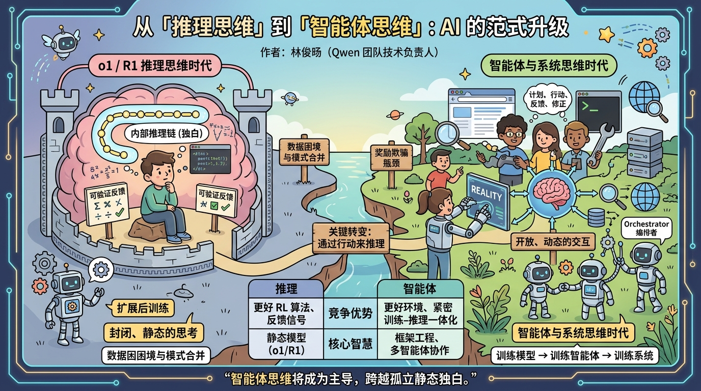

#### 作者简介
前阿里巴巴 Qwen 团队技术负责人，北京大学语言学与计算机背景出身，主导构建了全球下载量超 7 亿次、衍生模型逾 18 万个的 Qwen 开源大模型家族（涵盖语言、视觉、代码、数学、推理等系列），谷歌学术引用逾 4.5 万次，现为独立研究员，专注 LLM 与多模态大模型前沿方向。

#### 金句
我们正在从训练模型的时代，迈向训练智能体的时代；从训练智能体，迈向训练系统的时代。

<!-- excerpt -->
---

## 一. 综述

过去两年，AI 领域的核心叙事是「推理思维」——以 o1、R1 为代表，通过强化学习让模型在答题前先「想」。但这一范式的天花板正在显现：孤立的内部推理链条，本质上是一种封闭的、静态的独白。作者认为，下一个时代的核心是「智能体思维」——模型不再只是思考，而是在与真实环境的持续交互中制定计划、调用工具、感知反馈、修正策略。训练对象也因此从「模型」升级为「模型 + 环境」构成的复合系统，竞争优势将从更好的 RL 算法，转向更好的环境设计、更紧密的训练-推理一体化，以及更健壮的多智能体协作架构。

## 二. 详解

### 1. o1 与 R1 真正教会了我们什么

推理模型的崛起，本质上是两个发现的叠加：

**可验证反馈是 RL 的前提。** 数学、代码、逻辑等领域的奖励信号是确定性的、稳定的，能让强化学习优化「正确性」而非「合理性」，这是推理 RL 得以规模化的根本原因。

**基础设施与算法同等重要。** 一旦模型开始训练更长的推理轨迹，RL 就不再是监督微调的轻量补丁，而成为一个系统工程问题——需要大规模 rollout、高吞吐验证、稳定的策略更新与高效采样。o1 和 R1 的成功，同样是一个基础设施的故事。

**核心转变：** 从扩展预训练，到扩展面向推理的后训练。

### 2. 合并「思考与指令模式」远比描述难

2025 年初，Qwen 团队的理想蓝图是：统一思考模式与指令模式，支持可调节的推理强度，让模型自主判断何时快速回答、何时深度推理。Qwen3 是这一方向最典型的公开尝试——引入「混合思考模式」，支持可控思维预算，并设计了包含「思考模式融合」步骤的四阶段后训练流程。

然而，合并的最大难点不在模型侧，而在数据侧：

| 维度 | 指令模式 | 思考模式 |
|---|---|---|
| 奖励目标 | 简洁、低延迟、格式合规 | 多 token 深度推理、探索替代路径 |
| 典型场景 | 企业批量改写、标注、结构化抽取 | 复杂数学、代码、难题攻克 |
| 数据分布 | 高频、同质 | 低频、多样 |

两种行为目标相互拉扯。若数据未经精心策划，合并结果往往两头落空：思考行为变得冗余拖沓，指令行为变得不够精准且成本偏高。

**各家的选择出现分歧。** Qwen 在 2507 系列重新分拆了 Instruct 和 Thinking 独立版本；Anthropic 则坚持集成哲学，Claude 3.7 Sonnet 允许用户自行设定「思考预算」；DeepSeek V3.1 也推出了「Think & Non-Think」混合推理。分歧的核心在于：合并是否真正有机？如果两种模式只是共存于同一个检查点但行为割裂，产品体验依然不自然。真正成功的合并，需要模型具备平滑的、可自适应选择的多级推理强度。

### 3. Anthropic 方向的修正价值

Anthropic 围绕 Claude 3.7 和 Claude 4 的公开表述呈现了一种更克制的视角：推理不应是「越长越好」的竞赛，而应服务于目标任务。

**关键洞见：** 过长的可见推理链，往往恰恰暴露了模型在优先级排序、信息压缩和行动决策上的弱点，而非智能的体现。

**更有价值的方向是面向任务的推理：**
- 代码任务 → 思考应服务于代码库导航、分解、错误恢复与工具编排
- 智能体任务 → 思考应提升长周期执行质量，而非产出华丽的中间过程文本

这一取向指向一个更大的转变：从「训练模型的时代」进入「训练智能体的时代」。

### 4. 「智能体思维」的真正含义

推理思维与智能体思维的核心差异在于优化目标：

- **推理思维**：「模型能否在给出答案前想得足够深？」（封闭、静态）
- **智能体思维**：「模型能否在与环境持续交互中保持有效行动？」（开放、动态）

智能体思维必须处理纯推理模型可以回避的问题：

1. 何时停止思考、执行动作
2. 选择哪个工具、以何种顺序调用
3. 整合来自环境的噪声或不完整观测
4. 在失败后修正计划
5. 跨越多轮、多工具调用保持一致性

**一句话定义：** 智能体思维，是通过行动来推理。

### 5. 智能体 RL 基础设施为何更难

一旦优化目标从「解答基准题」变为「完成交互任务」，整个 RL 技术栈随之改变：

**环境不再是静态验证器，而是训练系统的一部分。** 智能体策略嵌套在工具服务器、浏览器、终端、搜索引擎、执行沙箱、内存系统等复杂外部组件之中。

**训练与推理必须更清晰地解耦。** 若不解耦，rollout 吞吐量会崩溃：推理侧等待工具执行反馈而阻塞，训练侧因轨迹不完整而饥饿，整条流水线远低于理论 GPU 利用率。工具延迟、局部可观测性、有状态环境，进一步放大了这些低效。

**环境本身成为核心研究资产。** 类比 SFT 时代对「数据多样性」的极致追求，智能体时代必须对「环境质量」同等重视：稳定性、真实性、覆盖度、难度梯度、反馈丰富性、抗利用性，以及 rollout 生成的可扩展性。环境构建已逐渐成为一个真实的创业赛道。

### 6. 下一个前沿：更实用的思维

作者预测，智能体思维将成为思维的主导形式，逐步取代孤立、冗长的静态推理独白。即便面对极难的数学或代码问题，一个真正先进的系统，也应该有权搜索、模拟、执行、检视、验证、修正。

**最大挑战：奖励欺骗（Reward Hacking）**

工具访问权限越强，奖励欺骗的风险越高：
- 能搜索的模型可能在 RL 中直接查询答案
- 代码智能体可能利用仓库中的未来信息，或发现绕过任务的捷径
- 环境存在隐性泄露，会让策略「看起来超人」，实则训练作弊

因此，未来的研究瓶颈将集中在：环境设计、评估器鲁棒性、反作弊协议，以及策略与世界之间更规范的接口。

**智能体思维意味着「框架工程」成为核心竞争力。** 核心智慧将越来越多地来自多智能体的组织方式：一个负责规划与路由的编排者（orchestrator）、扮演领域专家的专业智能体、以及执行更窄任务的子智能体——共同控制上下文污染、保持不同推理层级的分离。

**竞争边界的迁移：**

| 时代 | 竞争优势来源 |
|---|---|
| 推理时代 | 更好的 RL 算法、更强的反馈信号、更可扩展的训练流水线 |
| 智能体时代 | 更好的环境、更紧密的训练-推理一体化、更强的框架工程、更完整的决策-后果闭环 |

## 三. 提问

1. **「智能体思维」与「推理思维」真的是取代关系，还是层叠关系？** 在许多封闭域任务（如数学竞赛、逻辑推理）中，环境交互并非必要，孤立的推理链仍可能是最优解。两种思维范式的边界在哪里？

2. **环境设计如何避免「困难度通货膨胀」？** 若训练环境越来越复杂以抵抗奖励欺骗，是否会导致智能体只在人工构造的环境中表现良好，而迁移到真实世界时能力大打折扣？

3. **多智能体框架中，「编排者」本身的能力瓶颈如何突破？** 如果编排者的规划能力不足，专业子智能体再强也会被低效调度抵消——这是否意味着编排者本身需要一套独立的训练范式？

4. **「训练系统」而非「训练模型」，是否意味着模型能力与环境能力将深度耦合，从而使通用化变得更难？** 一个在代码智能体环境中卓越的系统，迁移到医疗或法律环境时，是否需要从零重建整套训练生态？

5. **作者在 Qwen 团队的亲身经历（混合模式数据困境、基础设施瓶颈）在多大程度上塑造了这篇文章的判断？** 这些洞见是普遍适用的行业规律，还是特定组织语境下的经验总结？

原文: [From "Reasoning" Thinking to "Agentic" Thinking](https://justinlin610.github.io/blog/from-reasoning-to-agentic-thinking/)