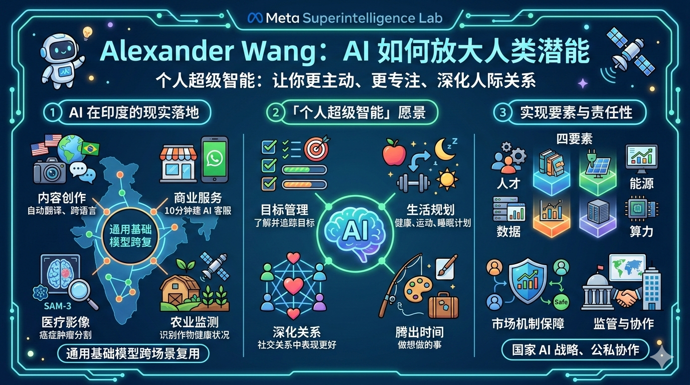

#### 作者简介
Alexandr Wang 于 2016 年以 19 岁 MIT 在读生身份创立 Scale AI，将其做到近 290 亿美元估值，2021 年以 24 岁成为全球最年轻的白手起家亿万富翁，现任 Meta 首席 AI 官，领导 Meta 超级智能实验室，主导 Meta 的 AI 战略方向。

#### 金句
个人超级智能不是让你被动盯着屏幕，而是让你在生活中更主动、更专注地追求目标、深化人际关系。

<!-- excerpt -->
---

## 一、综述

Alexander Wang 在印度的演讲围绕三个核心主题展开：AI 在印度的现实落地价值、Meta 对「个人超级智能」的愿景，以及实现 AI 广泛普惠所需的政策与公私协作框架。他以成长经历为引，阐述科技服务社会的底层信念，用印度本土的医疗、教育、农业、语言案例佐证 AI 的即时价值，并以竞争激励机制回应外界对 AI 责任性的质疑，最终呼吁政府与企业携手，将 AI 建设成真正服务于每个个体的基础设施。

## 二、详解

### 1. 成长环境塑造的两个核心信念

Wang 成长于新墨西哥州洛斯阿拉莫斯——一个聚集物理学家、超算专家与基因研究者的政府科研小镇。父母均为物理学家，母亲研究恒星内部等离子体行为。这一环境在他心中根植了两个信念：「任何事都有可能」与「科技应服务社会」。这两个信念驱使他在 MIT 研究 AI、创立 Scale AI，并最终加入 Meta 担任首席 AI 官。

### 2. Meta 的规模优势与印度机遇

Meta 的吸引力在于两点：足够的资源与野心推动 AI 科学突破，以及庞大的用户基础将技术真正送达普通人。全球每天有 35 亿人使用 Meta 旗下至少一款应用，仅印度就超过 5 亿用户。这一体量使 Meta 具备将 AI 落地的独特条件。

### 3. AI 在印度的现实应用案例

Wang 列举了多个印度本地的具体案例，说明 AI 已非愿景，而是正在创造价值：

| 领域 | 案例 | 效果 |
|------|------|------|
| 内容创作 | 创作者用 Meta AI 自动将短视频翻译成观众语言 | 跨语言触达 |
| 商业服务 | 小企业主在 WhatsApp 上 10 分钟内创建 AI 客服智能体 | 降低商业门槛 |
| 无障碍教育 | iSTEM 为印度 2000 万+ 残障人士构建语音优先 AI 基础设施 | 学习、求职、数字任务独立完成 |
| 医疗影像 | 阿育王大学基于 SAM-3 模型开发 Oncoseg，用于癌症肿瘤分割 | 将数小时工作压缩至数秒 |
| 农业监测 | AgriPoint 将同一分割技术用于识别作物叶片健康状况 | 通用模型跨场景复用 |
| 多语言识别 | Meta 开源全语言模型，覆盖 1600+ 种语言，少量音频样本即可快速适配新语言 | 数年内实现地球上所有语言的实时语音翻译 |

Wang 特别强调，通用基础模型的美妙之处在于跨领域复用：同一技术可以分割脑部肿瘤，也可以分割农作物叶片。

### 4. 「个人超级智能」：AI 的终极愿景

Meta 的 AI 定位是「个人超级智能」——了解你的目标与兴趣，并在你专注做事时提供帮助的 AI。它不只是完成行政琐事的工具，而是你的延伸，让你「成为更好的自己」。

具体场景包括：制定覆盖饮食、运动与睡眠的个人健康计划；追踪活动进展、联系场地、安排邀请函；帮你腾出时间做真正想做的事——钓鱼、绘画、旅行；在社交关系中帮你表现得更好。

Wang 正面回应了「AI 让人上瘾、被动刷屏」的担忧，指出个人超级智能的目标恰恰相反——激活人的主动性，而非消磨它。

### 5. 以竞争机制代替道德承诺——责任性的真正保障

Wang 拒绝用空洞的道德宣言来回应 AI 安全质疑，转而诉诸市场逻辑：AI 将深度了解每个用户，用户不会把如此私密的权限交给一家不负责任的公司。不安全、不透明的 AI 会流失用户、丧失公信力、输给竞争对手——这才是驱动 Meta 负责任行事的真实动因。

具体措施包括：发布模型卡片、评估基准与数据；投入模型评估科学研究；通过风险评估、规模化测试、红队攻防与微调在发布前识别潜在风险；监测用户使用 AI 的聚合趋势，形成反馈闭环；以及用 AI 持续强化治理机制本身。

### 6. AI 的四大基础要素与政策建议

Wang 将 AI 的实现条件归纳为四个基础要素：**人才、能源、数据、算力**。政府与产业界必须协作确保这四要素的可及性。他明确批评碎片化、不一致的监管条例会阻碍创新，主张各国制定大胆的国家 AI 战略，并在公私部门之间建立真正的伙伴关系。

Wang 强调，AI 不应是「一刀切」的产品，而应针对印度、全球南方乃至世界各地的具体挑战与机遇进行本地化设计，服务于每一个个体，无论其语言、文化与地域。

## 三、提问

1. **竞争能否真正替代监管？** Wang 以市场竞争作为 AI 负责任发展的保障机制，但在 AI 行业高度集中、用户转移成本极高的结构下，这一逻辑是否足够？

2. **「个人超级智能」的数据边界在哪里？** 一个深度了解用户目标、习惯、关系的 AI，需要收集和处理何种量级的个人数据？这与用户隐私之间的张力如何化解？

3. **通用模型的本地化能走多深？** Wang 展示了模型跨场景复用的潜力，但印度 22 种官方语言、数百种方言与复杂社会情境，能否真正被一个通用模型深度理解和服务？

4. **开源策略的可持续性？** Meta 开源多语言模型，是技术普惠的真诚选择，还是构建生态护城河的商业策略？两者并不互斥，但值得追问其边界与条件。

5. **「公私协作」的权力结构如何设计？** Wang 呼吁政府与企业成为伙伴，但当 Meta 这样的超大平台与政府谈判时，双方的议价能力是否对等？谁来定义「服务于本国公民」的标准？

原文: [FULL REMARKS: World's Youngest AI Billionaire Alexander Wang Reveals How AI Will Amplify Humans](https://www.youtube.com/watch?v=NwDa4m6sSGw)