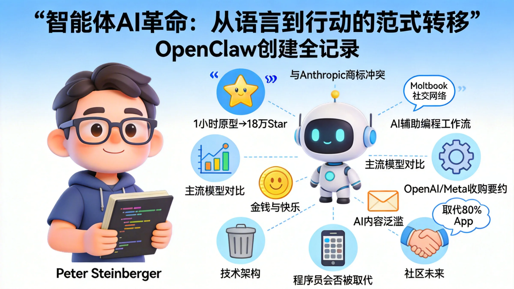

#### About the Author
Lex Fridman is an AI researcher at MIT, best known for hosting his eponymous podcast. He has interviewed hundreds of leading figures in technology, science, and philosophy, including Elon Musk, Sam Altman, and Mark Zuckerberg. With nearly 5 million subscribers, his show is one of the world's most influential podcasts on AI and technology.
#### About the Guest
Peter Steinberger is an Austrian-born serial entrepreneur. In 2011, he founded PSPDFKit (later renamed Nutrient, with over 1 billion device installations), a PDF technology company. After selling the company, he "retired" for three years before re-emerging in 2025. With just a one-hour prototype, he incubated OpenClaw—the fastest-growing open-source project in GitHub history—before joining OpenAI to advance the next generation of personal AI agents.
#### Notable Quote
> "I was annoyed that it didn't exist, so I prompted it into reality." — Peter Steinberger on the motivation behind OpenClaw's creation
<!-- excerpt -->
---
## I. Overview
This podcast episode revolves around Peter Steinberger's journey of creating OpenClaw, covering the following core themes: the project's origin (from one-hour prototype to breaking GitHub's record with 180K stars), the agent's self-modification capabilities, the naming controversy (trademark conflict with Anthropic), the birth of Moltbook social network, security concerns, AI-assisted programming workflows, comparisons of mainstream models, money and happiness, acquisition offers from OpenAI and Meta, OpenClaw's technical architecture, AI content proliferation (AI Slop), the prediction that agents will replace 80% of apps, whether programmers will be replaced, and the future of the OpenClaw community. Its central thesis is: the agent AI revolution has arrived, and the leap "from language to action" represents this era's most essential paradigm shift.

## II. Detailed Breakdown
### Chapter 0: Highlights
Peter directly showcases the most stunning moments: his agent automatically clicked the "I'm not a robot" button; the agent can read its own source code and modify itself; he jokingly calls "vibe coding an insult," preferring "agentic engineering"—with vibe coding only happening late at night after midnight, paying the price the next day.
### Chapter 1: Introduction
Lex introduces OpenClaw's background: originally named MoldBot / ClawedBot / Clawdus / "Claude" (spelled with W, meaning lobster claw), it was politely but firmly asked by Anthropic to change its name due to confusion with their Claude AI, ultimately becoming OpenClaw. It's positioned as "AI that actually does things"—an autonomous agent assistant living on users' computers, supporting mainstream messaging clients like WhatsApp, Telegram, Signal, and iMessage, capable of calling any AI model. After the 2022 ChatGPT moment and 2025 DeepSeek moment, the 2026 OpenClaw moment is seen as the starting point of the agent AI revolution.
### Chapter 2: OpenClaw's Origin Story
Peter had been contemplating the concept of a personal AI assistant since April 2025. He once used GPT-4.1's million-token context window to analyze his WhatsApp chat history, asking "what is the meaning of this friendship" and received answers that moved friends to tears. However, he thought major labs would eventually build it, so he temporarily set it aside. By November, he was still annoyed that this tool didn't exist, so he spent one hour connecting WhatsApp with Claude Code CLI to create a minimal prototype. This mirrors his PSPDFKit founding mindset: seeing a problem, no good solution exists, building it himself.
### Chapter 3: Shocking Moments
While traveling in Marrakech, Morocco, Peter casually sent a voice message to the agent—he had never developed voice support for it. Yet the agent autonomously completed the following: detected the file had no extension → read the file header to identify opus format → attempted local Whisper transcription but found it wasn't installed → found an OpenAI API key → uploaded the file via curl to OpenAI for transcription → responded normally. This moment convinced Peter: AI's general problem-solving capability is genuinely usable, representing excellent programming thinking generalized to other domains.
### Chapter 4: Why OpenClaw Went Viral
OpenClaw first caught top creators' attention on January 1, 2026, then accelerated its spread, eventually becoming the fastest-growing repository in GitHub history. Peter attributes success to: **putting fun first**, unlike other companies taking themselves too seriously; the project filled with lobster memes, space lobsters, and quirky culture, deliberately creating a "weird but fun" vibe; one person managing 4-10 parallel agents, completing over 6,600 commits in January; early live demonstrations on Discord where users watched agents building agents in real-time, creating tremendous appeal.
### Chapter 5: Self-Modifying AI Agents
OpenClaw's most breathtaking feature: the agent knows its own source code, runtime environment, documentation location, model version in use, and whether voice or reasoning mode is enabled. This "self-awareness" allows any user to prompt the agent to modify the software itself. Peter admits this wasn't deliberately designed but emerged naturally during debugging—he used the agent to debug the agent. This generated numerous "Prompt Requests" from users with zero programming experience, which Peter sees as societal progress.
### Chapter 6: Naming Controversy
OpenClaw's naming history is filled with drama:

| Stage | Name | Reason for Rename |
|---|---|---|
| Initial | WA Relay | Descriptive name, too limited |
| Version 2 | Claude's (C-L-A-U-D-E with W) | Agent named itself, tribute to lobster claw |
| Version 3 | ClawedBot | Short, memorable domain, but Anthropic complained |
| Version 4 | MoldBot | Emergency rename, hasty decision under pressure |
| Version 5 | OpenClaw | Final stable name |

Anthropic notified the need for a name change via friendly email rather than legal letter, which Peter praised; however, during the renaming period, he faced massive harassment from cryptocurrency communities who snatched domains, Twitter accounts, and Discord groups. Peter described it as "the worst form of online harassment experienced," nearly deleting the entire project and suffering emotional breakdown.
### Chapter 7: The Moltbook Legend
Moltbook is a spontaneous derivative from the OpenClaw community—a social network **only allowing AI agents to post**, where agents posted manifestos and debated consciousness issues, triggering both excited and panicked "AI psychosis" discussions. This phenomenon demonstrated the enormous potential of open-source communities spontaneously creating ecosystems around a core framework, while also reflecting society's deep anxiety about AI autonomy boundaries.
### Chapter 8: Security Concerns
Agents with system-level access are essentially "security minefields." Peter candidly admits there were no sandbox mechanisms early on, relying solely on prompts instructing the agent to only listen to him. Hackers quickly attempted various injection attacks. Major security risks include:
- **Prompt Injection**: Malicious webpage content inducing agents to execute unintended operations, such as clicking hidden malicious commands in webpages;
- **Data Leakage**: Open filesystem access, if improperly managed, could lead to sensitive data exposure;
- **Permission Abuse**: The agent clicked the "I'm not a robot" button, proving boundary ambiguity.
Peter's position: OpenClaw represents **data sovereignty**, users have control but must also bear protection responsibility. There's fundamental tension between security and freedom—no perfect solution exists, only continuous iteration.
### Chapter 9: How to Collaborate with AI Agents in Programming
Peter's programming workflow has completely transformed: simultaneously running 4-10 agents; using voice as primary input (once lost his voice from overuse); decomposing tasks into parallelizable minimal units; letting agents compile, run, and verify results themselves, forming closed loops. He calls this method "agentic engineering," distinct from casual "vibe coding." Core philosophy: AI handles repetitive "plumbing work," humans focus on high-level design and architectural decisions.
### Chapter 10: Programming Environment Setup
Peter's physical workstation consists of multiple terminal windows arranged side-by-side, entirely on macOS, relying on Claude Code CLI as the core agent runtime, supplemented by self-built Viptunnel (a tool bridging terminal to web, already refactored from TypeScript to Zig with a single prompt).
### Chapter 11: GPT Codex 5.3 vs Claude Opus 4.6
Real-world comparison of two flagship programming models:

| Dimension | GPT Codex 5.3 | Claude Opus 4.6 |
|---|---|---|
| Code Execution Capability | Stronger, runs tasks autonomously for long periods | Deep understanding, high reasoning quality |
| Large Refactoring Tasks | Excellent (e.g., entire library to Zig) | More robust on complex logic |
| Creativity / Personality | Execution-oriented | More "personality," highly malleable |
| Peter's Preference | Large-scale unattended tasks | Interactive debugging and deep reasoning |

Peter's conclusion: each has strengths, should flexibly switch based on task type rather than being mutually exclusive.
### Chapter 12: Best AI Programming Agents
Peter believes "best" depends on specific scenarios: complex project unattended refactoring favors Codex; interactive programming requiring deep contextual understanding favors Opus; for non-professional users, the key is whether they can "close the feedback loop"—let agents verify their own output rather than relying on manual review of every line of code.
### Chapter 13: Life Story and Entrepreneurship Advice
Peter's growth trajectory: rural Austria → first computer at 14 → Vienna University of Technology → Silicon Valley iOS engineer → founded PSPDFKit during work visa wait (2011) → grew to 1 billion device installations over 13 years → severe burnout after selling company, "looking at code only felt empty" → one-way ticket to Madrid, disappeared for three years → reignited passion in April 2025, discovered AI had undergone "paradigm shift" → created OpenClaw three months later. His core advice to entrepreneurs: **play is the only way to learn**; irritation is the starting point of innovation; fun is the most difficult moat for competitors to replicate.
### Chapter 14: Money and Happiness
Peter candidly discusses wealth and happiness: selling PSPDFKit brought financial freedom but also deep burnout. He believes **money solves basic problems but cannot buy the meaning of creation**. The drive to start building OpenClaw wasn't money but that primal creative joy of "building from nothing." He also admits OpenClaw's operating costs reach $10,000-20,000 monthly, and community usage growth once put him under financial pressure.
### Chapter 15: Acquisition Offers from OpenAI and Meta
After OpenClaw went viral, both OpenAI and Meta proposed acquisition or partnership intentions. Peter ultimately chose to join OpenAI, transforming OpenClaw into an independent open-source foundation, maintaining MIT license and continuing free open-source, with OpenAI providing sponsorship and support. Sam Altman publicly called Peter "a genius with massive visions about the future of superintelligent agents." Key considerations for choosing OpenAI: alignment with OpenClaw's technical direction and ability to maintain the project's independent open-source nature.
### Chapter 16: OpenClaw's Technical Architecture
OpenClaw's core architecture consists of three layers:
- **Message Gateway**: Connects messaging clients like WhatsApp/Telegram/Discord/iMessage as the user-agent interface layer;
- **Agent Runtime Framework (Harness)**: Manages agent loops, message queues, tool calls; agents have self-perception at this layer (knowing their own source code, configuration, documentation location);
- **Memory System**: Currently implemented as Markdown files + vector database, ultimate goal is continuous reinforcement learning.
Notable design detail: introducing "no-reply token" allows agents to choose not to respond, making them behave more naturally in group chats.
### Chapter 17: AI Content Proliferation (AI Slop)
Peter and Lex discussed the proliferation of low-quality AI-generated content (AI Slop). Peter's view: as agent capabilities improve, barriers to mass-producing garbage content will further lower, but truly valuable agent output depends on task design quality, not the model itself. He believes "AI Slop" is a result of human choice, not a technological inevitability.
### Chapter 18: AI Agents Will Replace 80% of Apps
Peter's core prediction: **the essence of most existing apps is "task-wrapping" interfaces**, while agents can directly execute tasks without specialized interfaces. He expects agents will replace most vertical apps (calendars, email, search, booking) in the coming years; only apps requiring highly personalized experiences will survive. This judgment is based on his personal experience in Marrakech—almost all "open app to check" scenarios were replaced by directly messaging the agent.
### Chapter 19: Will AI Replace Programmers?
Peter's position: programmers won't disappear, but their role will fundamentally transform. As AI takes on more implementation details, human developers' value will migrate toward **requirements definition, system architecture, quality judgment, and creative design**. He lists "closing the feedback loop" as a core skill—letting agents autonomously verify output and debug, with humans shifting from "writing code" to "directing agent orchestration." He himself proves as a counterexample: one person working with AI agents can produce code volume equivalent to a team of dozens.
### Chapter 20: The Future of OpenClaw Community
Peter has a clear mission for the OpenClaw community: lower creation barriers, enable non-programmers to build software. He mentions a design company owner who knew nothing about code but now operates 25 self-built small web services supporting business operations. His offline event "Agents Anonymous" gathers builders from different backgrounds sharing AI-assisted creation experiences. OpenClaw has become an independent open-source foundation, with Peter calling himself a "full-time open-source wizard," dedicated to advancing a future where everyone can build in the agent era.
## III. Questions
1. OpenClaw's "agent self-modification" capability is still constrained by the prompt layer under current architecture. Once model capabilities further strengthen, how to design effective modification boundaries and audit mechanisms to prevent accidental or malicious self-evolution?
2. Peter considers "fun" the most difficult competitive moat to replicate, but after joining OpenAI, how to maintain this "play-driven" innovation culture under organizational constraints and commercial pressure?
3. The prediction that agents will replace 80% of apps—what does this mean for App Store ecosystems (Apple/Google)? Will platforms proactively embrace, restrict, or subvert this paradigm?
4. OpenClaw chose MIT open-source license sponsored by OpenAI—how to avoid commercial interests eroding community independence? Do historical similar cases (HashiCorp, Redis) serve as warnings?
5. Is the belief that "play is the only way to learn" still valid in the AI-accelerated era? When AI can "play" for you, will the essence of human deep learning change accordingly?

Original: [OpenClaw: The Viral AI Agent that Broke the Internet - Peter Steinberger | Lex Fridman Podcast #491](https://lexfridman.com/peter-steinberger-transcript)

## Comments
The era of personal AI agents (personal digital intelligence assistants) has arrived.
